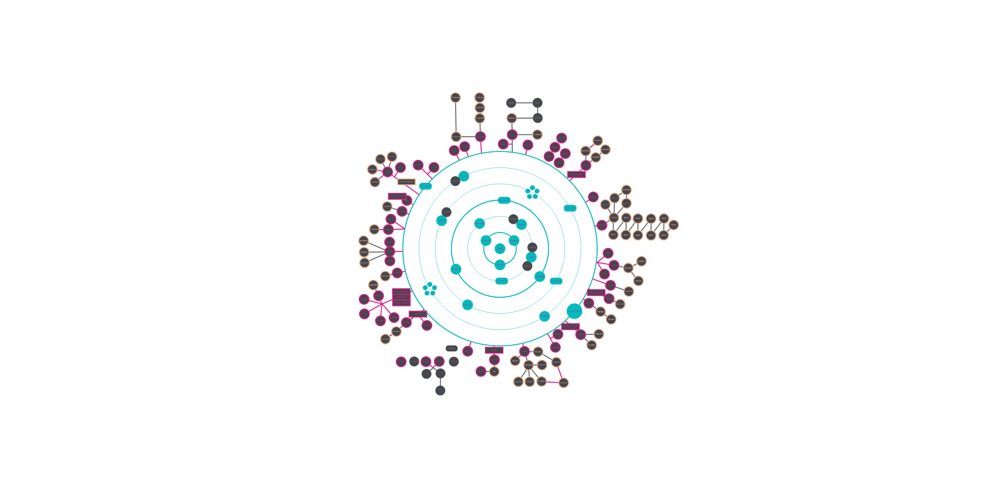

# 42 Common Core Projects

A comprehensive collection of completed projects from the 42 School common core curriculum, showcasing various programming concepts and system administration skills.

[](https://www.42.fr/) [](https://en.wikipedia.org/wiki/C_(programming_language)) [](https://en.wikipedia.org/wiki/C++_language)

## 42 Cursus Holy Graph



## Table of contents

* [Introduction](#introduction)
* [Projects Overview](#projects-overview)
* [Installation](#installation)
* [Usage](#usage)
* [Known issues and limitations](#known-issues-and-limitations)
* [Contributing](#contributing)
* [License](#license)
* [Special Thanks](#special-thanks)

## Introduction

This repository contains a collection of projects completed during the 42 School common core curriculum. Each project focuses on different aspects of programming and system administration, helping students build a strong foundation in computer science concepts.

## Projects Overview

### Level 0

- **[Libft](./42_LIBFT)**: A custom C library implementing standard functions

### Level 1

- **[Born2beRoot](./42_BORNTOBEROOT)**: System administration project using virtual machines
- **[ft_printf](./42_FT_PRINTF)**: Recreation of the printf function
- **[get_next_line](./42_GET_NEXT_LINE)**: Function for reading lines from file descriptors

### Level 2

- **[push_swap](./42_PUSH_SWAP)**: Sorting algorithm implementation
- **[pipex](./42_PIPEX)**: Unix pipe mechanism implementation
- **[fdf](./42_FDF)**: 3D wireframe renderer

### Level 3

- **[philosophers](./42_PHILOSOPHERS)**: Thread and process synchronization
- **[minishell](./42_MINISHELL)**: Shell implementation

### Level 4

- **[cub3d](./42_CUB3D)**: Raycasting-based 3D game engine
- **[NetPractice](./42_NETPRACTICE)**: Network configuration exercises
- **CPP-Module 0-4**: Cpp exercice to understand difference between C

### Level 5

- **[inception](./42_INCEPTION)**: Docker-based system administration
- **[IRC](./42_IRC)**: Internet Relay Chat server implementation
- **CPP-Module 5-9**: Cpp exercice to understand difference between C

### Level 6

- **[transcendence](./42_TRANSCENDENCE)**: Full-stack web application (Pong game)

## Installation

Each project has its own installation requirements and procedures. Navigate to the specific project directory and follow the instructions in its README file.

General prerequisites:

- GCC/Clang compiler
- Make
- Git
- Various project-specific dependencies

## Usage

Each project can be used independently. Basic usage instructions:

1. Clone the repository:

```sh
git clone <repository-url>
```

2. Navigate to the desired project:

```sh
cd 42_PROJECT_NAME
```

3. Follow the project-specific README for compilation and usage instructions.

## Known issues and limitations

- Projects follow 42 School norms and guidelines
- Some projects may have specific OS requirements
- External libraries usage is limited by project requirements

## Contributing

This is an educational project. Contributions are not expected, but learning and exploration are encouraged.

## License

Project is part of 42 School curriculum. Refer to school guidelines for usage and redistribution.

## Special Thanks

I would like to express my sincere gratitude to:

### 42 Perpignan Staff

* The pedagogical team for their guidance and support
* The technical staff for maintaining our learning environment
* The administrative team for their continuous assistance

### Fellow Students

* My peers at 42 Perpignan for the countless hours of peer-to-peer learning
* The amazing community that made this journey both challenging and enjoyable
* Special mention to those who participated in countless code reviews and debugging sessions

### Community

* The active 42 Network slack community
* Open source contributors whose work inspired many solutions
* Stack Overflow community for their invaluable assistance

This journey would not have been possible without the collaborative spirit that makes 42 such a unique learning experience. Thank you all for being part of this adventure!

_"Innovation distinguishes between a leader and a follower." - Steve Jobs_
